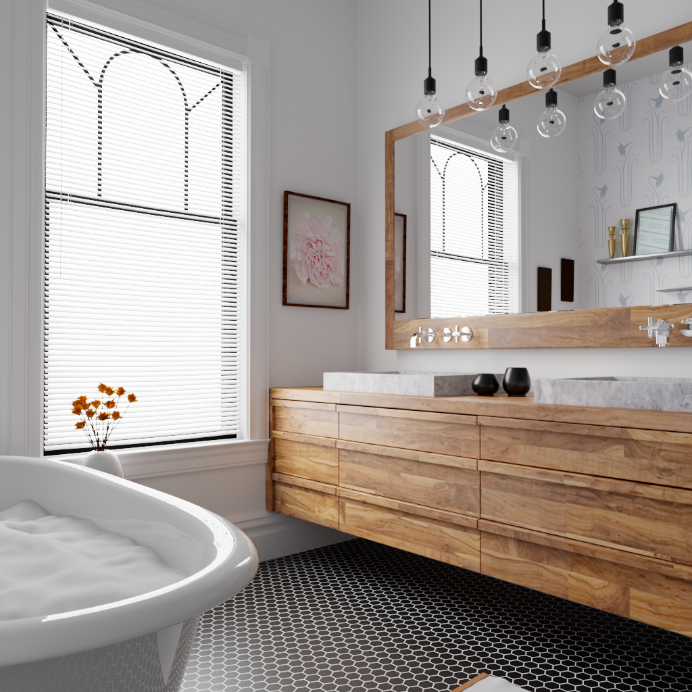
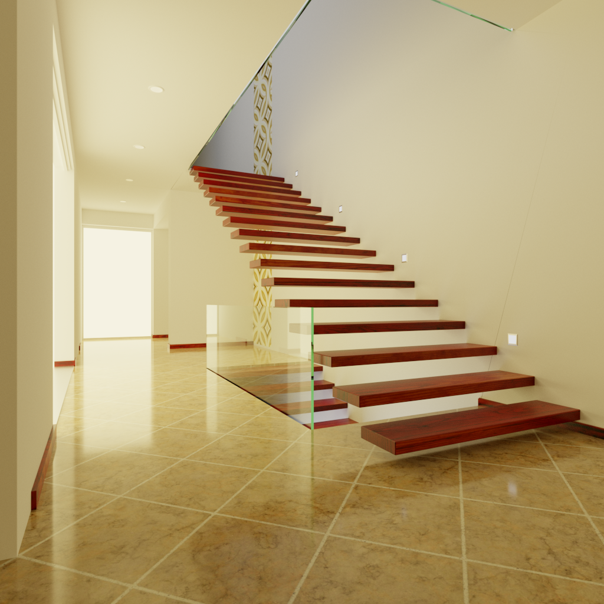
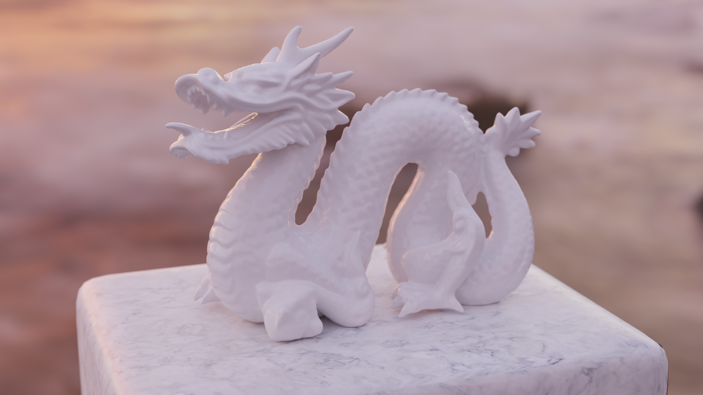
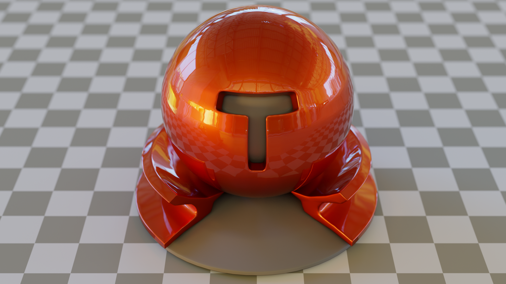

# A simple physically-based path tracer

This is a physically-based path tracer I wrote from scratch in Rust to better understand how modern renderers work.
Below are some renders it produced.









Rendering actually touches many domains (geometry, image reconstruction, spatial data structures, optics, …) and learning all of them was fun, challenging and rewarding.
The codebase is much simpler than feature-rich reference implementations such as [pbrt](https://www.pbrt.org/) or [Mitsuba](http://mitsuba-renderer.org/), but poorly documented.

## Features

- Full physically based global illumination using unbiased unidirectional pathtracing with multiple importance sampling (BSDF and direct light sampling)
- Support meshes composed millions of triangles (the dragon above has more than 800k triangles) loaded from OBJ files and some geometric primitives (sphere, parallelogram, …)
- Area lights (parallelogram and sphere shaped) and Image Based Lighting (see the dragon above)
- Several physically based materials:
	- Smooth dielectric (glass), conductor (metal) and plastic with accurate Fresnel effects
	- Rough dielectric, conductor and plastic based on the GGX microfacet model described in [Microfacet Models for Refraction through Rough Surfaces](https://diglib.eg.org/handle/10.2312/EGWR.EGSR07.195-206)
	- Clearcoat model as described in [Arbitrarily layered micro-facet surfaces](https://dl.acm.org/citation.cfm?doid=1321261.1321292) which produces nice metallic paint effects (see the test ball above)
- Bitmap textures (loaded from common image formats) that can be used to describe material albedo but also roughness (when applicable)
- Two-levels acceleration structure system based on Bounded Volume Hierarchies constructed with the Surface Area Heuristic
- Depth of Field effect
- Fully parallelized rendering
- Progressive rendering with live preview in a SDL window (can be disabled)

## Usage

As this project is not meant for real-use, the interface is not very polished.
There are two ways to describe a scene to render.

- Describe a scene in Rust with the provided library.
  An example is given in `examples/cornell.rs` and can be executed with:

  ```
  cargo run --release --example=cornell
  ```

- Use the Tungsten file format, although only a *very* limited subset is supported.
  An example of scene can be found in `scenes/material-testball` and rendered with:

  ```
  cargo run --release --bin=render_tungsten -- scenes/material-testball/scene.json
  ```

The current render is saved in `/tmp/image.ppm` when exiting the preview.

## TODO

- Bump mapping
- Adaptive sampling

## Credits

The bathroom, staircase and material test ball scenes are [courtesy of Benedikt Bitterli](https://benedikt-bitterli.me/resources).

